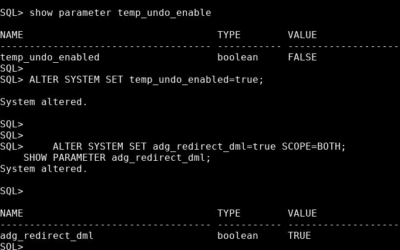
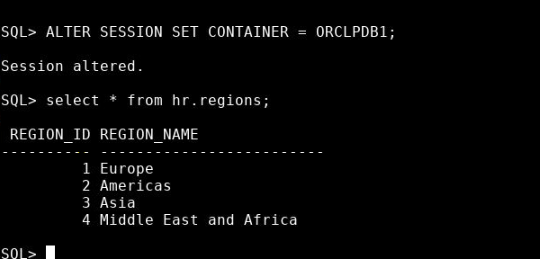

# Oracle Data Guard 19c Lab Guide: Using Oracle Active Data Guard

## Supported Workloads in Read-Only Standby

### Practices Overview

In these practices, you will configure the Active Data Guard standby databases to support various offloadable workloads such as real-time query, DML/DDL on Global Temporary Tables, and read-mostly applications.

---

### Enable Active Data Guard Real-Time Query

**Objective:** Enable the Active Data Guard with the real-time query feature and verify its operation.

#### Tasks:

1. **Set Active Data Guard Parameters**:

Use the terminal session on `localhost`. 

    ```
    [oracle@localhost ~]$ . oraenv
    ORACLE_SID = [orclcdb] ? orclcdb

    ```
    [oracle@localhost ~]$ sqlplus / as sysdba
    ```

Run following commands to set Active Data Guard Parameters:

    ```sql
    ALTER SYSTEM SET temp_undo_enabled=true;
    ALTER SYSTEM SET adg_redirect_dml=true SCOPE=BOTH;
    SHOW PARAMETER adg_redirect_dml;
    ```



2. **Prepare the Standby Database**:
    - Use a terminal window logged in as `oracle` to `orcldg`.
    - Ensure the environment variables are set for `orcldg`.

    ```
    [oracle@localhost ~]$ . oraenv
    ORACLE_SID = [orclcdb] ? orcldg

    [oracle@localhost ~]$ sqlplus / as sysdba
    ```

    - Confirm that the physical standby database and its `orclpdb1` PDB are in `READ ONLY` mode.

    ```
    SQL> alter database open read only;
    ```

    **Note:** You can ignore if you get already open error.

3. **(Optional) Open the Standby Database**:
    - If the physical standby database is in the `MOUNT` state, stop the redo apply service and open the `orclpdb1` database in `READ ONLY` mode.


    ```
    ERROR at line 1:
    ORA-10456: cannot open standby database; media recovery session may be in
    progress
    ```

    Run following command incase you get above error:

    ```
    SQL> alter database recover managed standby database cancel;
    Database altered.

    SQL> alter database open read only;

    Database altered.
    ```

4. **Confirm Database Open**:
    ```
    SQL> alter pluggable database ORCLPDB1 open;
    ```
    
    **Note:** You can ignore if you get already open error.

4. **Enable Real-Time Query**:
    - Restart the Redo Apply process on the physical standby database running in the `READ ONLY` mode. This will enable the real-time query feature.

    ```
    SQL> alter database recover managed standby database disconnect;
    ```

5. **Check Connection to CDB**:

This database is using the Oracle Multitenant option. The default operating system authentication method for the multitenant container database (CDB) is to the container root (CDB$ROOT). Data Guard environment operations are performed at the CDB level. Schema objects like the sample schemas exist in customer created pluggable databases (PDBs). Verify that the SQL*Plus session is currently connected to the CDB$ROOT and that sample schemas do not exist in the root container. Two ways are illustrated to determine the current container name. The first technique uses the SQL*Plus show commands. The second technique uses all SQL syntax. The HR.REGIONS table is part of the sample schemas, but should not exist in the root container.

- Confirm that the SQL*Plus session is currently connected to the `CDB$ROOT`.
- Ensure that sample schemas, such as `HR.REGIONS`, do not exist in the root container.

```
SQL> show con_id

SQL> show con_name

SQL> SELECT sys_context ('USERENV', 'CON_NAME') FROM dual;

SQL> select * from hr.regions;

...
select * from hr.regions
*
ERROR at line 1:

ORA-00942: table or view does not exist
```


6. **Switch to the orclpdb1 PDB**:

Switch the SQL*Plus session to the ORCLPDB1 pluggable database (PDB) and query the HR.REGIONS table again


```
SQL> ALTER SESSION SET CONTAINER = ORCLPDB1;

Session altered.

SQL> select * from hr.regions;

REGION_ID REGION_NAME

1	Europe
2	Americas
3	Asia
4	Middle East and Africa
SQL>
```




6. **Switch to the orclpdb1 PDB (Primary)**:

Leave the above window open. Open a terminal window (if not already open) logged in as oracle to localhost with the environment variables set for `orclcdb` appropriately. Launch SQL*Plus and switch session to the `orclpdb1` PDB of the primary database. Query the HR.REGIONS table

- In the SQL*Plus session, switch to the `orclpdb1` pluggable database (PDB).
- Query the `HR.REGIONS` table again to confirm its presence.

```
SQL> ALTER SESSION SET CONTAINER = ORCLPDB1;

Session altered.

SQL> select * from hr.regions order by region_id;

REGION_ID REGION_NAME

1	Europe
2	Americas
3	Asia
4	Middle East and Africa

```

7. **Insert a Row in Primary Database**:
    - Open a new terminal window, logged in as `oracle` to `localhost`.
    - Set environment variables for `orclcdb`.
    - Launch SQL*Plus, switch to the `orclpdb1` PDB of the primary database, and query the `HR.REGIONS` table.
    - Insert a new row into the `HR.REGIONS` table and commit the transaction.

    ```
    SQL> insert into hr.regions values (5,'Australia');
    1 row created.

    SQL> commit;
    Commit complete.
    ```

8. **Verify Real-Time Query on Standby**:
    - Switch back to the SQL*Plus session connected to the `orclpdb1` PDB on the `orcldg` standby database.
    - Query the `HR.REGIONS` table. The new row should be immediately available on the physical standby database, showcasing the real-time query capability of Active Data Guard.

    ```
    SQL> select * from hr.regions order by region_id;

    REGION_ID REGION_NAME
    1	Europe
    2	Americas
    3	Asia
    4	Middle East and Africa
    5	Australia
    ```

9. **Cleanup**:
    - Exit SQL*Plus on the `standby` standby database. Keep the terminal session open with the appropriate environment variables set.
    - Exit SQL*Plus on `localhost`, but keep the window open for subsequent labs.

### Conclusion:

You've successfully enabled and tested the real-time query feature of Active Data Guard. This powerful feature ensures that data on the standby database is immediately available for read operations as soon as it's committed on the primary database.
