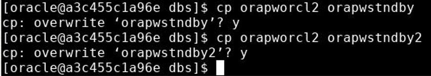

# Establishing Local and Remote Connections with DGMGRL

## Overview

In this lab, you'll engage with the DGMGRL utility to establish both local and remote connections. The primary database's password file will be updated, and then it will be propagated to all destinations in the Data Guard configuration.

> **Note**: The `oracle` user is affiliated with the `dgdba` group. As part of the class setup, this group was linked with the SYSDG privilege for Data Guard.  Also, you may need to unlock the account
> The `sysdg` grant is exemplified as:

   > ```sql
   > SQL> grant sysdg to system;
   > ```


## Tasks:

### 1. **Utilizing DGMGRL with OS Authentication**:
   - Start the DGMGRL utility and ensure that you can connect as the SYSDG user utilizing operating system (OS) authentication. (The `oracle` OS user is a member of the `dgdba` group.)

   ```
   [oracle@localhost ~]$ dgmgrl

   DGMGRL> connect sysdg
   
   Password: << sysexit >> Connected to "orclcdb"
   ```   

   > **Note**: For local connections using OS authentication, any password is acceptable. However, for switchover and failover operations to a remote site, the correct password is mandatory.

### 2. **Remote Connection to Physical Standby**:
   - Try to establish a remote connection to the physical standby database `orcldg` as the SYSDG user. The password from the password file should be used. Exit DGMGRL after this step.
   
   ```
   DGMGRL> connect sysdg@orcldg
   Password: fenago
   ORA-01017: invalid username/password; logon denied

   DGMGRL> exit
   [oracle@localhost ~]$
   ```

   > **Note**: During the database's creation, the choice was made to employ the same password for all co-administrative accounts. However, this applied solely to the SYS and SYSTEM database accounts.

### 3. **Updating the SYSDG Password**:
   - On `localhost`, using SQL*Plus, connect as SYSDBA. Reset the SYSDG password and unlock the account. Exit SQL*Plus afterward.
   - In the current terminal window on `localhost`, propagate the amended password file to all other systems, overwriting the existing password files. On `orcldg`, a password file is required for both the physical and logical standby databases. During the copying process, the password files should be renamed to fit each destination's appropriate names.
   
   ```
   [oracle@localhost ~]$ sqlplus / as sysdba


   SQL> alter user sysdg identified by fenago;

   User altered.

   SQL> alter user sysdg account unlock;

   User altered.

   SQL> grant sysdg to sysdg;

   Grant succeeded.

   SQL> exit
   ```


### 4. **Password File**:

   - In the current terminal window on localhost, copy the modified password file to all other machines overwriting the password files that are already there. On orcldg, a password file is needed for both the physical standby database and the logical standby database. The password files should be renamed during the copy to the appropriate names for each destination.



   > **Note**: From Oracle Database 19c Release 2 (19.3.0.1) onwards, any changes made to the password file on the primary database are auto-propagated to the standby databases. The only exception is for far sync instances. For these instances, because they only receive redo but don't apply it, the updated password files must be manually transferred.

### 5. **Verifying Remote Connection**:
   - Initiate the DGMGRL utility on `localhost`. Make sure that you can now form a remote connection as `sysdg` to the physical standby database. Conclude the DGMGRL session after this.

   ```
   [oracle@localhost ~]$ dgmgrl

   DGMGRL> connect sysdg/<password>@orcldg 

   Connected to "orcldg"
   Connected as SYSDG. 

   DGMGRL> exit
   ```

## Conclusion:

At the end of this lab, you'll have effectively utilized DGMGRL to establish both local and remote connections and updated the password files accordingly to reflect changes in authentication settings.
