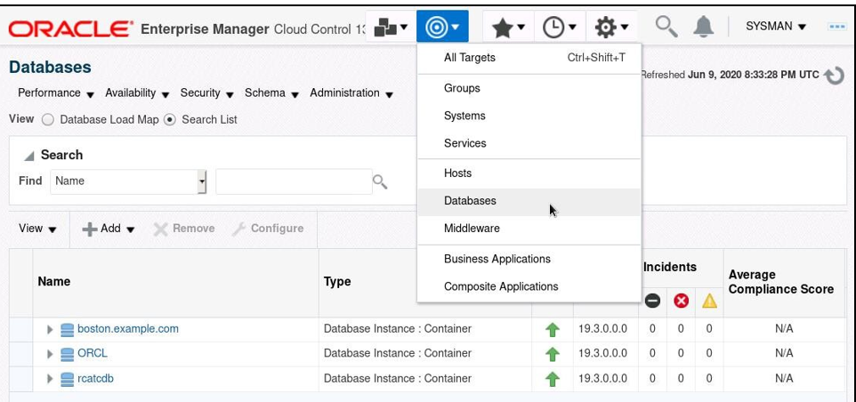
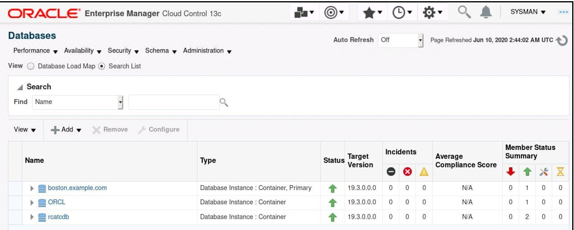
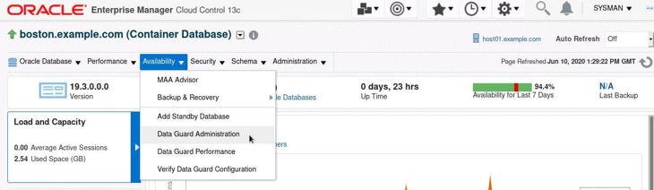
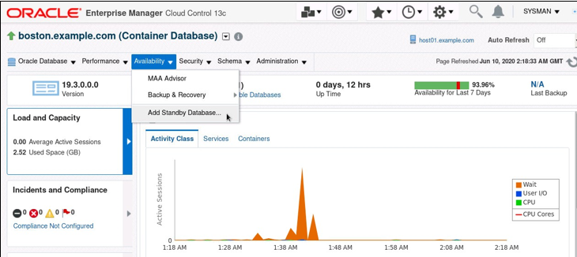
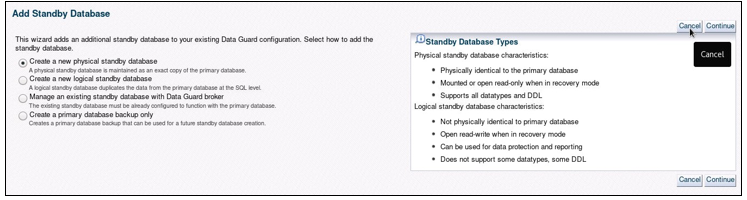
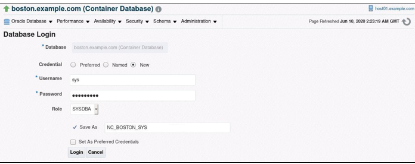

# Verify and Examine the Data Guard Environment

## Overview

In this exercise, you will identify the components of the Data Guard broker configuration. Moreover, you will investigate and confirm the Data Guard broker setup via Enterprise Manager Cloud Control 13c.

Note:  all passwords are on the file on the desktop


## Starting OEM (Oracle Enterprise Manager):

1. **Access Terminal**:
   - Open a terminal window on your machine.
   
2. **Navigate to OEM Directory**:
   - Set ORACLE_SID = `orcloem` using oraenv and make sure orcloem database is started:

   ```
   . oraenv
   sqlplus / as sysdba
   startup
   ```

3. **Start OEM**:
   - Run the following command to start OEM:

   ```bash
   /u02/middleware/bin/emctl start oms
   ```

   - To check OMS status, run the following command:

   ```bash
   /u02/middleware/bin/emctl status oms
   ```

3. **Start EM Agent**:
   - Run the following command to start the EM Agent:

    ```bash
   /u02/agent/agent_inst/bin/emctl start agent
   ```

   - To check EM agent status, run the following command:

   ```bash
   /u02/agent/agent_inst/bin/emctl status agent
   ```
---

## Tasks:

### 1. **Access Enterprise Manager via Firefox**:
   - Click on the Firefox Web Browser icon to access Enterprise Manager 13c.

### 2. **Access Cloud Control**:
   - Input the URL for Cloud Control specific to your setup: `http://HOST_IP:7803/em`

   **Note:** If you have OEM installed locally, you can replace host_ip with **localhost**.


### 3. **Log into Enterprise Manager Cloud Control 13c**:
   - Use the username `sysman` and the respective password (it's case-sensitive).


### 4. **Autodiscover orcldg**:

You can autodiscover the orcldg by doing:

- `Setup` > `Add Target` > `Add Targets Manually` > `Add Using Guided Process`
- Click on the "Oracle Database, Listener...." and Add..
- Click magnifying glass next to host and then select the only host found, then hit next
- Processing will take 30-60 seconds
- Check the orcldg database and then click "Specify Common Monitoring Credentials"
- Change role to sysdba and enter sys and fenago for ID and password
- Click "Configure" and change Listener Machine to be "localhost"
- After that test connection
- Click next and then save


### 5. **Navigate to Databases Page**:
   - If you're not already on the Databases page, go there by selecting `Targets`, then `Databases` from the dropdown.



### 6. **Access orclcdb Target**:
   - Click the link corresponding to the `orclcdb` target.



### 7. **Access Data Guard Administration**:
   - From the orclcdb database homepage, choose `Data Guard Administration` from the `Availability` menu.




> **Optional**: If only the `Add Standby Database` link is visible, click it. This will redirect you to the Data Guard home page instead of starting the Add Standby Database Wizard. 



> **Optional**: If you're brought to the `Add Standby Database` page, simply click `Cancel` to get to the Data Guard home page.



### 8. **Database Login**:
   - On the Database Login Page, opt for `New` under the Credential option and input:
     - Username: `sys`
     - Password: `<password>`
     - Role: `SYSDBA`
     - Save As: `NC_ORCLCDB_SYS`
   - Click `Login`.



### 9. **Data Guard Home Page**:
   - On this page, you'll see the Data Guard configuration you set up earlier.

### 10-11. **Review Configuration and Database Status**:
   - Check out the `Overview` and `Primary Database` sections, showing the status of the Data Guard setup and the primary database respectively.
   - Further, review the `Standby Databases` section to see configuration members and their roles/statuses.

### 12. **Inspect Redo Source**:
   - Continue perusing the `Standby Databases` section to understand the Redo Source for each member. Here, you can also opt to `Add Far Sync` or `Add Standby Database`.

### 13. **Performance Analysis**:
   - Review the `Performance` and `Additional Administration` sections to access more Data Guard performance links.

### 14. **Verify Configuration**:
   - Click on `Verify Configuration`. Post-verification, detailed results will be showcased.

> **Note**: The verification might end with warnings. These can be overlooked for now.

### 15. **Return to Data Guard Administration Page**:
   - Click `OK` to return to the Data Guard Administration page.

---


## Conclusion:

By the end of this exercise, you'll have a comprehensive understanding of your Data Guard broker setup via Enterprise Manager Cloud Control 13c.
