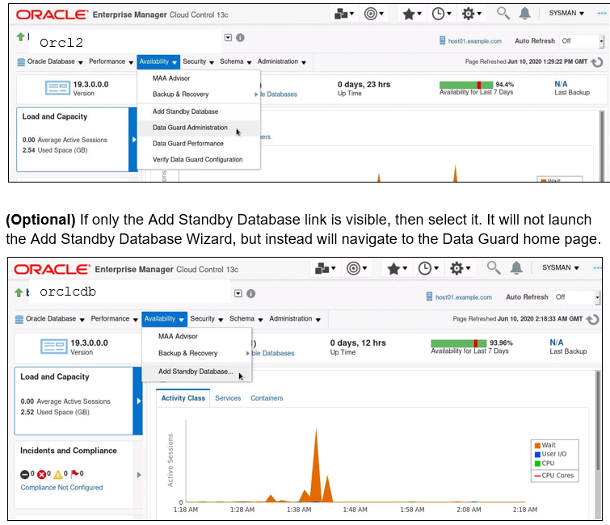
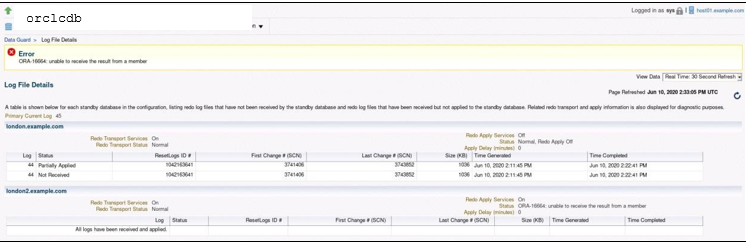

# Monitoring the Physical Standby Database

## Overview

In this exercise, you'll utilize DGMGRL for both local and remote connections. The password file will be refreshed on the primary database and disseminated to all destinations in the Data Guard configuration.

---

## Tasks:

### 1. **Initiate DGMGRL**:
   - Open a terminal window on localhost, ensure environment variables are set for `orclcdb`, and initiate DGMGRL. Connect as the `SYSDG` user using OS authentication.

   ```
   [oracle@localhost ~]$ . oraenv
   ORACLE_SID = [oracle] ? orclcdb

   [oracle@localhost ~]$ dgmgrl

   DGMGRL> connect sysdg/<password>@orclcdb 
   ```

### 2. **Inspect Timeouts**:
   - Use `SHOW CONFIGURATION VERBOSE` to view the current `CommunicationTimeout` and `OperationTimeout` property values.

   ```
   DGMGRL> show configuration verbose
   ```

### 3. **Update CommunicationTimeout**:
   - Adjust the `CommunicationTimeout` property to 300. Confirm the change.

   ```
   DGMGRL> edit configuration set property 'CommunicationTimeout' = 300;

   DGMGRL> show configuration verbose
   ```

> **Note**: Regularly, this isn't required, but it aids labs in the VM architecture.

### 4. **Update OperationTimeout**:
   - Modify the `OperationTimeout` property to its maximum of 300. Verify the change.

   ```
   DGMGRL> edit configuration set property 'OperationTimeout' = 300;

   DGMGRL> show configuration verbose
   ```

### 5. **Examine Standby Status**:
   - Use `SHOW DATABASE` for the physical standby database to check the current transport lag, apply lag, and apply rate.

   ```
   DGMGRL> show database orcldg
   ```

### 6. **Halt Redo Apply**:
   - Cease redo apply on the physical standby to induce an apply rate lag.

   ```
   DGMGRL> edit database orcldg set state = 'APPLY-OFF';
   ```

### 7. **Log Switch on Primary**:
   - Without exiting DGMGRL, force a log switch on the primary database.

   ```
   DGMGRL> SQL "alter system switch logfile";
   ```

### 8. **Inspect Apply Lag Rate**:
   - Use `SHOW DATABASE` for the physical standby database to view the present apply lag rate.

   ```
   DGMGRL> show database orcldg
   ```

### 9. **Check Standby Receive Queue**:
   - Display the standby receive queue for the physical standby.

   ```
   DGMGRL> show database orcldg 'RecvQEntries';
   ```

### 10-12. **Enterprise Manager Navigation**:
   > **Optional**: Navigate to the orclcdb database home page. On the orclcdb database home page, click **Data Guard Administration** in the Availability menu.
  



### 13-14. **Log File Details**:
   > **Optional**: On the Data Guard homepage, click on `Log File Details` in the Performance section. Here, you can see a list of log files yet to be received and applied.
   > **Note**: The ORA-16664 message is non-critical.




### 15. **Restart Redo Apply**:
   - Reactivate redo apply on the physical standby database. After a brief pause post-activation, ensure the apply lag is resolved. Conclude your DGMGRL session afterward.

   ```
   DGMGRL> edit database orcldg set state = 'APPLY-ON';

   DGMGRL> show database orcldg

   DGMGRL> exit;
   ```

## Conclusion:

By the conclusion of this exercise, you'll have a comprehensive understanding of monitoring and managing the physical standby database using DGMGRL and optional steps with Enterprise Manager.
