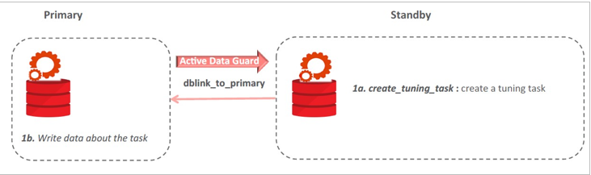
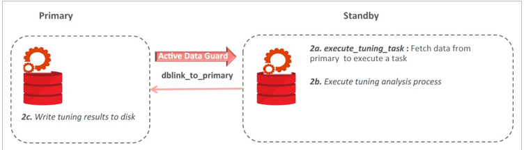
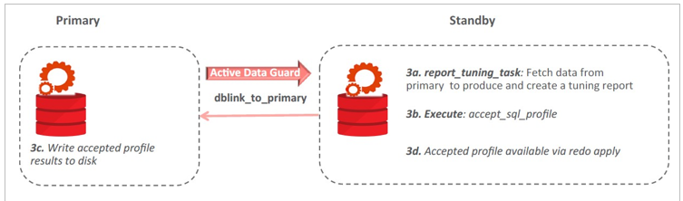

Lab: Using SQL Tuning Advisor for an Active Data Guard Instance
---------------------------------------------------------------

### Overview

> In this lab, you will see how to use SQL Tuning Advisor for
> Active Data Guard.
>
> The Active Data Guard (ADG) Databases are widely used to offload
> reporting or ad hoc query-only jobs from primary. Reporting workload
> profile is different from primary and often requires tuning. Starting
> with Oracle Database 12.2, you can run SQL Tuning Advisor to tune SQLs
> workloads running on ADG database.

-   All changes are done on primary and propagated from primary to
    standby by redo apply.

-   The data required for running the tuning tasks are fetched from the
    primary.

-   Support for PDB level tuning

-   Test execution (heavy lifting) happens on standby; only minimal
    write related activity on primary.

### Tasks

1.  (**Reference Only, DO NOT RUN**) The environment for this practice
    has been set up with the setup\_STA.sh script. This script created
    the OE.PRODUCTS, OE.ORDER\_ITEMS, OE.orders, OE.CUSTOMERs, and
    OE.storeS tables.

2.  Use a terminal window logged in as oracle to localhost with the
    environment variables set for orclcdb appropriately. Log in to the
    DEV1 PDB as the SYS user and run the setup13- 4.sql script.

    ```
    [oracle@localhost ~]$ . oraenv
    ORACLE_SID = [oracle] ? orclcdb
    The Oracle base remains unchanged with value /u01/app/oracle

    [oracle@localhost ~]$ sqlplus sys/<password>@localhost:1521/dev1 as sysdba

    SQL> @/home/oracle/setup/setup13-4.sql
    SQL> exec dbms_stats.delete_table_stats('OE','orders'); PL/SQL procedure successfully completed.
    SQL> exec dbms_stats.delete_table_stats('OE','order_items); PL/SQL procedure successfully completed.
    ```

3.  Switch to the CDB root container and create a database link in the
    primary database for the standby database.

    ```
    SQL> connect / as sysdba

    SQL> CREATE DATABASE LINK dblink_to_primary CONNECT TO SYS$UMF IDENTIFIED BY <password> USING 'orclcdb';
    ```

4.  Use a terminal window logged in as oracle to stndby with the
    environment variables set for stndby appropriately. Launch SQL\*Plus
    and run the problem query in the DEV1 PDB.

    ```
    [oracle@stndby ~]$ . oraenv
    ORACLE_SID = [oracle] ? stndby
    The Oracle base remains unchanged with value /u01/app/oracle 

    [oracle@stndby ~]$ sqlplus / as sysdba

    SQL> alter session set container=dev1;

    SQL> show pdbs

    SQL> @/home/oracle/setup/problem_query.sql

    
    3	SQL> SELECT /* problem_query */
    4	   SUM(UNIT_PRICE *1.10) revenue, o.order_id   --, order_status, order_datetime
    5	   FROM Order_items I join orders o
    6	   On o.order_id = i.order_id
    7	   WHERE o.order_datetime < sysdate
    8	   group by o.order_id          
    1950 rows
    SQL>
    ```

5.  Find sql\_id of the problem query.

    ```
    SQL> select sql_id, sql_text from v$sql where sql_text like '%problem_query%';
    ```

6.  Open a new terminal window logged in as oracle to stndby with the
    environment variables set for stndby appropriately.

    ```
    [oracle@stndby ~]$ . oraenv
    ORACLE_SID = [oracle] ? stndby
    The Oracle base has been set to /u01/app/oracle 
    
    [oracle@stndby ~]$ sqlplus / as sysdba
    ```

7.  In the same terminal session, verify that the sql\_id of the problem
    query is visible. **Note:** At times, the problem query doesn't
    appear in the CDB root container due to an internal delay. If that
    is the case, return to the terminal session used in step 4 and run
    the problem\_query.sql script again.

    ```
    SQL> select sql_id, sql_text from v$sql where sql_text like '%problem_query%';
    ```

8.  Create a SQL Tuning Task.

    

    ```
    SQL> @/home/oracle/setup/create_sts.sql
    SQL> set echo on SQL> DECLARE
    2	stmt_task VARCHAR2(64);
    3	BEGIN
    4	stmt_task:=dbms_sqltune.create_tuning_task(sql_id => 'an7zryzf86prm', task_name => 'Tune_problem_query', database_link_to => 'DBLINK_TO_PRIMARY.EXAMPLE.COM');
    5	END;
    6 /

    PL/SQL procedure successfully completed.
    ```

    **Note:** If you receive ORA-13780: SQL
    > statement does not exist, return to the terminal session used in step
    > 4 and run the problem\_query.sql script again.

9.  Execute the SQL Tuning Task.

    

    ```
    SQL> @/home/oracle/setup/exec_sts.sql
    SQL> set echo on
    SQL> EXECUTE dbms_sqltune.execute_tuning_task(task_name => 'Tune_problem_query');
    ```

10. Generate the SQL Tuning Task report.

    

    ```
    SQL> @/home/oracle/setup/get_sts.sql
    ```

11. Return to the terminal session connected to localhost. Switch to the DEV1 container.

    ```
    SQL> show con_name

    SQL> alter session set container=dev1;
    ```

12. Optionally, implement the recommendations.

    > **Note:** If the recommendation is about the implementation of a
    > profile, you can accept the profile directly in the standby database.
    > The accepted profile is written to the primary database. Then the same
    > profile is available in the standby database via redo apply.

    ```
    SQL> execute dbms_stats.gather_table_stats(ownname => 'OE', tabname => 'ORDER_ITEMS, estimate_percent => DBMS_STATS.AUTO_SAMPLE_SIZE, method_opt => 'FOR ALL COLUMNS SIZE AUTO');

    PL/SQL procedure successfully completed.

    SQL> execute dbms_stats.gather_table_stats(ownname => 'OE',tabname => 'ORDERS', estimate_percent => DBMS_STATS.AUTO_SAMPLE_SIZE, method_opt => 'FOR ALL COLUMNS SIZE AUTO');
    PL/SQL procedure successfully completed. SQL>
    ```

13. Exit SQL\*Plus on all hosts leaving the current terminal windows.
