Practice 14-2: Keeping Physical Standby Session Connected During Role Transition
--------------------------------------------------------------------------------

### Overview

> In this practice, you will use Enterprise Manager Cloud Control 13c
> and DGMGRL to view the configuration status, validate that the
> databases are ready for a role reversal, and then perform a
> switchover. During the switchover, you will observe how the session
> connected to the physical standby database is controlled with the
> STANDBY\_DB\_PRESERVE\_STATES parameter.

### Tasks

1.  With the navigation techniques learned
    in practice 10-3, navigate to the Databases pages.

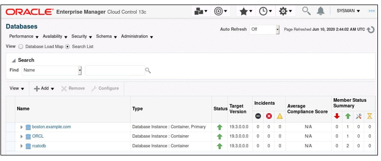

2.  Add the orcldg database as an EM target
    in preparation of the Switchover practice through Enterprise
    Manager. Click **Add** \> **Oracle Database**.

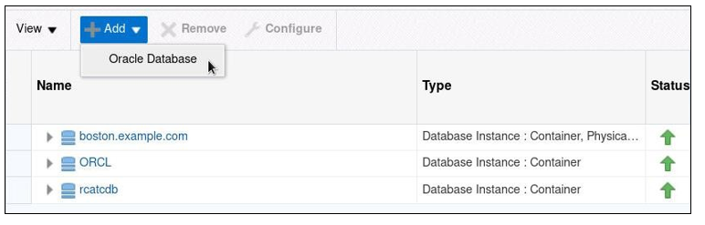

3.  On the Database Discovery: Search
    Criteria page, enter the name of the host (orcldg) by clicking the
    magnifying glass icon and selecting the host name in the dialog box.
    Then click **Next** to proceed.

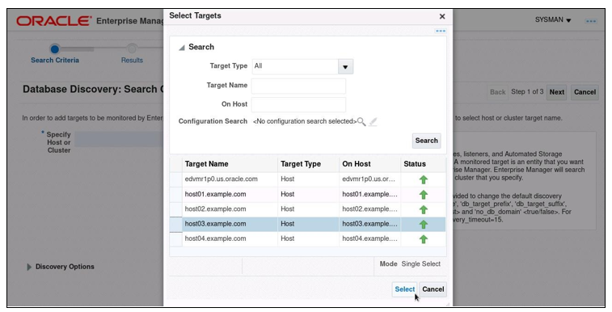

4.  On the Database Discovery: Results page, select the orcldg database
    and provide the following information:

    -   Monitor Username: sys

    -   Monitor Password: \<password\>

    -   Role: SYSDBA

> **Note:**
> You can also choose dbsnmp to lower the privilege instead of the SYS
> user.

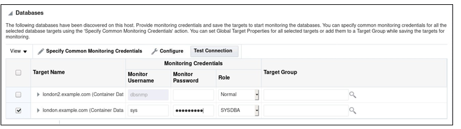

5.  Select the listed listener on orcldg.
    Click **Next**.

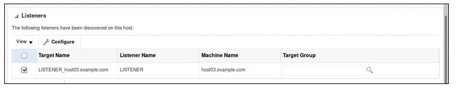

6.  On the Database Discovery: Review page, click **Save**.

7.  In the Confirmation dialog box, click **Close**.

8.  On the Databases page, set the Auto Refresh option
    to 30 seconds and wait until the orcldg.example.com target becomes
    normal. Click the link for the orclcdb.example.com target.

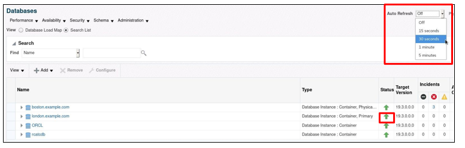

9.  On the orclcdb.example.com database home page, select **Data Guard
    Administration** from the Availability menu.

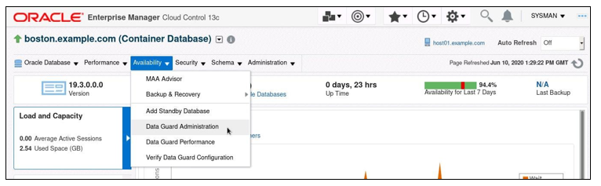

**(Optional)** If only the **Add Standby
> Database** link is visible, then select it. It will not launch the Add
> Standby Database Wizard, but instead, will navigate to the Data Guard
> home page.

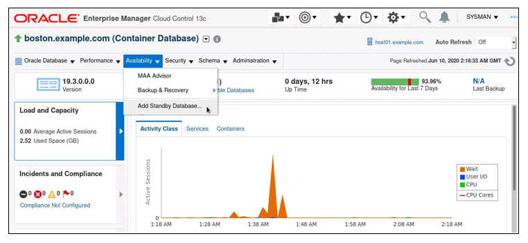

> **(Optional)** If the Add Standby Database link shows the Add Standby
> Database page, click
>**Cancel** to navigate to the Data Guard
> home page.

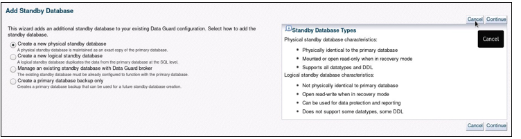

> (**Optional**) On the Database Login Page, select **New** in the
> Credential option with the following values. Click **Login**.

-   Username: sys

-   Password: *\<password\>*

-   Role: SYSDBA

-   Save As: NC\_ORCLCDB\_SYS2

10. On the Data Guard home page, make sure
    that the status of the current primary and physical standby is
    Normal.

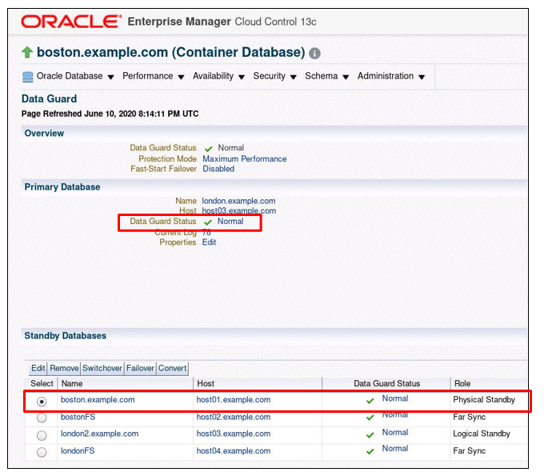


11. Use the terminal connected to localhost as oracle with the
    environment variables set to orclcdb. Launch SQL\*Plus and connect as the SYS user.

    ```
    [oracle@localhost ~]$ . oraenv
    ORACLE_SID = [oracle] ? orclcdb
    The Oracle base has been set to /u01/app/oracle [oracle@localhost ~]$ sqlplus / as sysdba

    SQL*Plus: Release 19.0.0.0.0 - Production on Sat Jun 6 07:36:51 2020
    Version 19.3.0.0.0

    (c) 1982, 2019, Oracle. All rights reserved.
    ```


12. Set the value of the STANDBY\_DB\_PRESERVE\_STATES parameter to
    SESSION and restart the orclcdb database.

    ```
    SQL> alter system set STANDBY_DB_PRESERVE_STATES = session
    scope=spfile;

    System altered.

    SQL> shutdown immediate
    Database closed. Database dismounted.
    ORACLE instance shut down. SQL> startup
    ORACLE instance started.

    Total System Global Area 629145352 bytes Fixed Size	9137928 bytes Variable Size		373293056 bytes Database Buffers 239075328 bytes
    Redo Buffers	7639040 bytes Database mounted.
    Database opened.

    SQL> show pdbs
    ```


> **Note:** When a physical standby database is converted to a primary,
> you have the option of keeping any sessions connected to the physical
> standby connected, without disruption,
> during the switchover or failover. SESSION means user sessions are
> retained during a switchover or failover.

13. Open the DEV1 PDB and start the Media Recovery Process. Exit
    SQL\*Plus.

> **Note:** If the Media Recovery process is already running, you will
> receive the ORA-01153
> error message. You can safely proceed to the next step.

  ```
    SQL> alter pluggable database dev1 open;

    Pluggable database altered.

    SQL> alter database recover managed standby database disconnect;
    alter database recover managed standby database disconnect
    *
    ERROR at line 1:
    ORA-01153: an incompatible media recovery is active

    SQL> exit
    Disconnected from Oracle Database 19c Enterprise Edition Release
    19.0.0.0.0 - Production Version 19.3.0.0.0 [oracle@localhost ~]$
    ```


14. Now, let's establish a new session for testing.

    ```
    [oracle@localhost ~]$ sqlplus oe/<password>@localhost:1521/dev1.example.com

    SQL*Plus: Release 19.0.0.0.0 - Production on Sat Jun 6 08:57:31 2020
    Version 19.3.0.0.0

    (c) 1982, 2019, Oracle. All rights reserved.
    Last Successful login time: Fri Jun 05 2020 22:19:26 -04:00 Connected to:
    Oracle Database 19c Enterprise Edition Release 19.0.0.0.0 - Production
    Version 19.3.0.0.0

    SQL> col username format a10
    SQL> select username, sid, serial# from v$session where sid=SYS_CONTEXT('USERENV','SID');
    ```


15. With the navigation techniques learned, return to the EM Data Guard
    Home page. Switch over to the orclcdb physical standby database like
    the following.

> **Note:** If the EM page shows a warning message due to the restart of
> the orclcdb database, refresh the bowser.

a.  On the EM Data Guard Home page, select
    orclcdb.example.com in the Standby Databases section. Click
    **Switchover**.

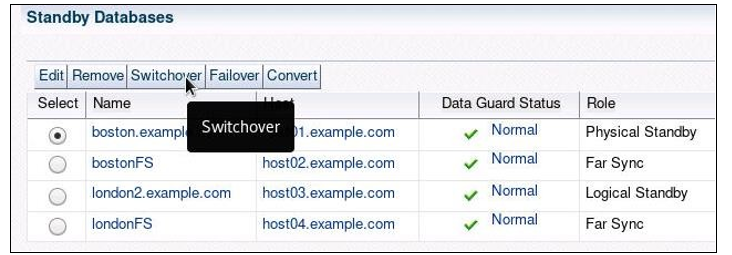

b.  On the Host Login (localhost.example.com) page, select **Preferred**
    in the Credential option. Click **Continue**.

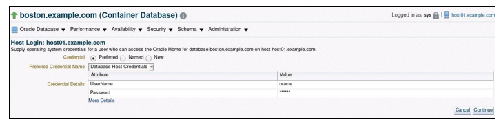

c.  On the Host Login (orcldg.example.com)
    page, select **Preferred** in the Credential option. Click
    **Continue**.

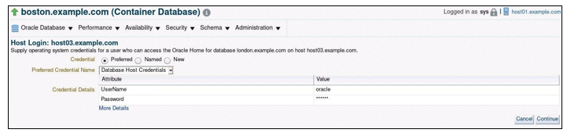

d.  On the Confirmation page, click **Yes**.

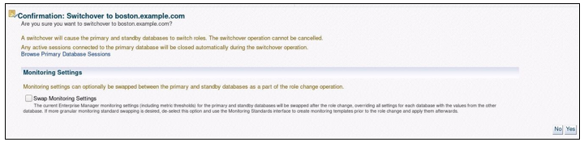

e. Monitor the progress of Switchover.
    **DON'T WAIT** for completion. Move on to the next step.


16. Return to the SQL\*Plus session connected on localhost. Check the
    current status of the OE
> session periodically. Exit SQL\*Plus.

+---------------+---+-----+---+----------+---------+
| > SQL\> **/** |   | SID |   | SERIAL\# |         |
| >             |   |     |   |          |         |
| > USERNAME    |   |     |   |          |         |
+===============+===+=====+===+==========+=========+
| > OE          |   |     |   | > 42     | > 40779 |
| >             |   |     |   |          |         |
| > SQL\> **/** |   |     |   |          |         |
+---------------+---+-----+---+----------+---------+
| > USERNAME    |   | SID |   | SERIAL\# |         |
+---------------+---+-----+---+----------+---------+
| > OE          |   |     |   | > 42     | > 40779 |
| >             |   |     |   |          |         |
| > SQL\> **/** |   |     |   |          |         |
+---------------+---+-----+---+----------+---------+

+----------------+---+-----+---+----------+---------+
| USERNAME       |   | SID |   | SERIAL\# |         |
+================+===+=====+===+==========+=========+
| OE             |   |     |   | > 42     | > 40779 |
|                |   |     |   |          |         |
| SQL\> **/**    |   |     |   |          |         |
+----------------+---+-----+---+----------+---------+
| USERNAME       |   | SID |   | SERIAL\# |         |
+----------------+---+-----+---+----------+---------+
| OE             |   |     |   | > 42     | > 40779 |
|                |   |     |   |          |         |
| SQL\> **exit** |   |     |   |          |         |
+----------------+---+-----+---+----------+---------+

> **Note:** The OE session hangs for a while and resumes. With the new
> feature, the session is retained during role transition.

17. Return to the EM page. Once the
    switchover operation is complete, you will see the new primary
    database on the Data Guard home page.

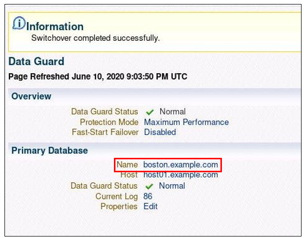