Lab: Setting up Oracle data guard
=================================


In this lab, we are going to look at your configuration and establish your configuration.

Start oracle database/services before proceeding.

Right click mouse and click open terminal:

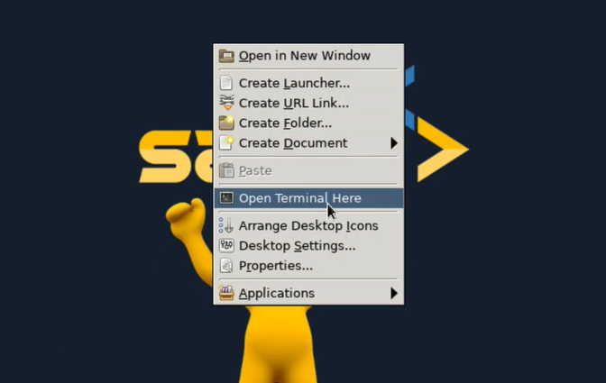

Let's switch over to oracle user.

`su - oracle`

There's gonna be two databases that we're gonna be working with.


The first database, if I do an echo `ORACLE_SID` is **orclcdb**.  That is going to be my root database or that is going to be,  that's gonna be my source database, my target database.

`echo $ORACLE_SID`

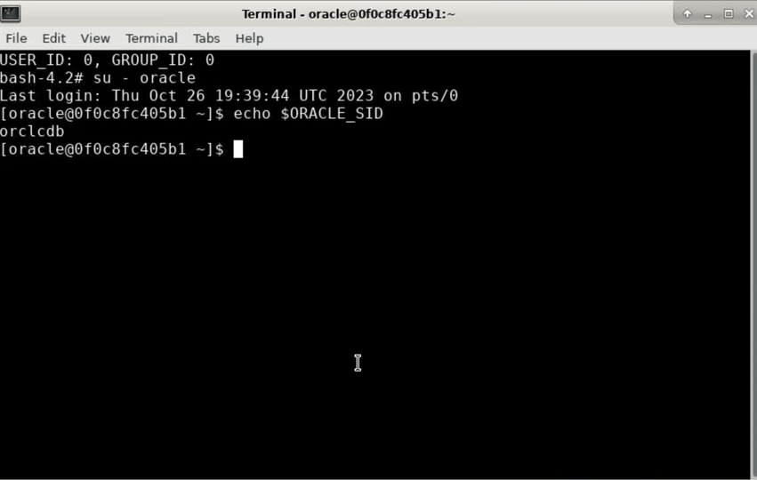

and the secondary database is `orcldg`:

`. oraenv`

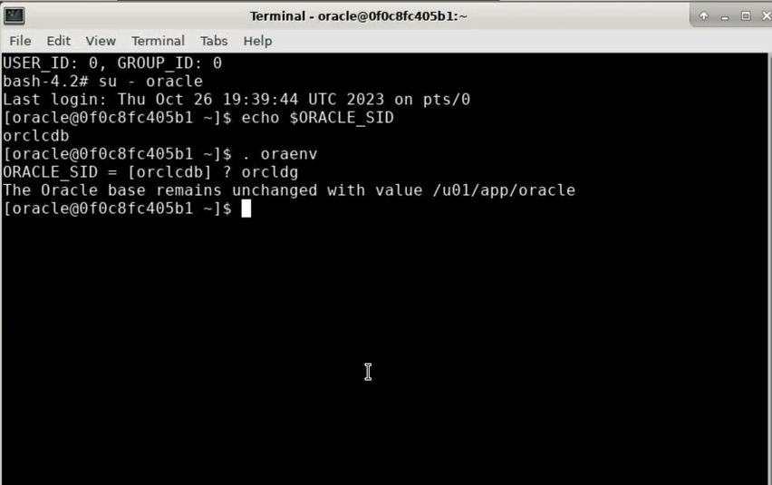


Okay, so the primary is `orclcdb` and the secondary is `orcldg`.


So, let's change environment variable back to the primary `orclcdb`:

`. oraenv`


And let's connect using sqlplus:

`sqlplus / as sysdba`

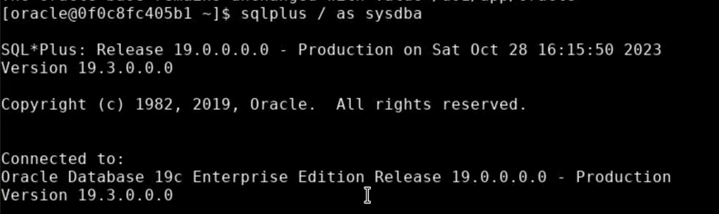


And then I'm gonna say create pfile from spfile.

`create pfile='/home/oracle/initorclcdb.ora' from spfile;`

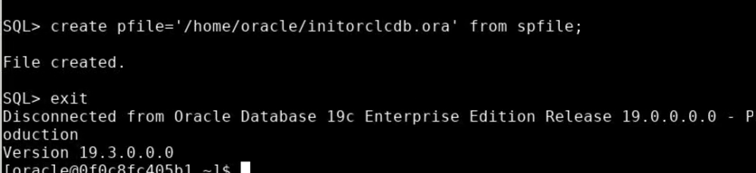


So this is gonna change the pro the parameter file and I'm gonna come over here and I'm gonna open it up and I'm gonna review it for you.

`vi initorclcdb.ora`

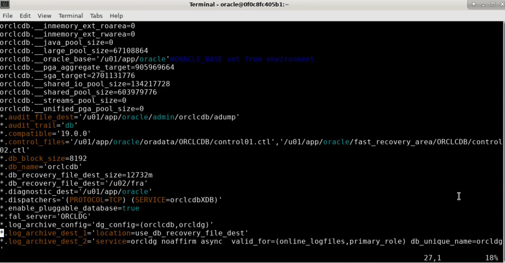


**Review initorclcdb.ora file**

So for our data guard configuration, what we're looking for the parameters, we can see that we have control files.

We can specify that we have a log archive desk one and a log archive desk two log.

Archive desk one is pointing to the DB recovery file desk one, our particular case, the DB recovery file desk is pointing to `/u02/fra`.


We are enabling pluggable databases.

The failover server is dg and we have a log archive config, which is `orclcdb` and `orcldg`. So these also have to be set.

So on the source we wanna make sure that the `orclcdb` that's the database name and then the unique name is the same here.


Now, set `orcldg` using **. oraenv**

```
. oraenv

sqlplus / as sysdba
```


Let's issue this command:

`create pfile='/home/oracle/initorcldg.ora' from spfile;`


`vi initorcldg.ora`


And on the secondary, the parameters that are really important to us is that we see that the database name is `orclcdb`.


So the database name is the same as the primary, but the database unique name is its own unique name. So it's, `orcldg`.


And again, we have its log archive destination set to DB recovery file desk and its destination two. It's also set to, or `orclcdb` valid for online log files in the primary role.


So this is kind of the parameters that we need to set on this secondary. So in the secondary you have to make sure that the database name is the same as the primary, but it has its own unique name. 


Okay, and let's take a look at the settings on the primary and the settings that we word on the primary are the locations. 

`vi initorclcdb.ora`

so here the database and database unique name are the same, but the log archive dest is gonna be local and the
dest one is gonna be local and destination two is gonna be remote.


So now let's go ahead and start our duplication process.


So all of our scripts are going to be located under Oracle base admin and we have a director here called DG Scripts.

`cd $ORACLE_BASE/admin/scripts/dg_scripts`

So these are all are really super important scripts. 

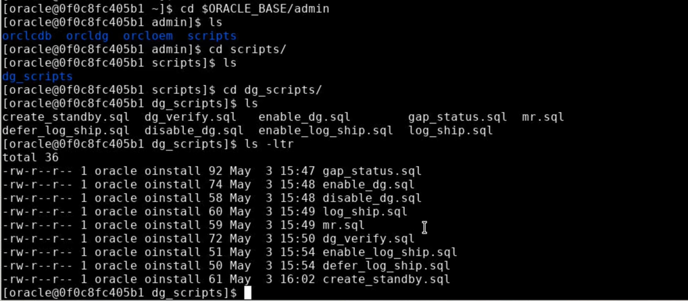


Also, we need to make sure that we're doing static registration.


`cd $ORACLE_HOME/network/admin/listener.ora`


Now look at the listener OA file. We can see,  that we can see we're doing static registration for the
source as well as the destination. And those are the things that we'd want to see.

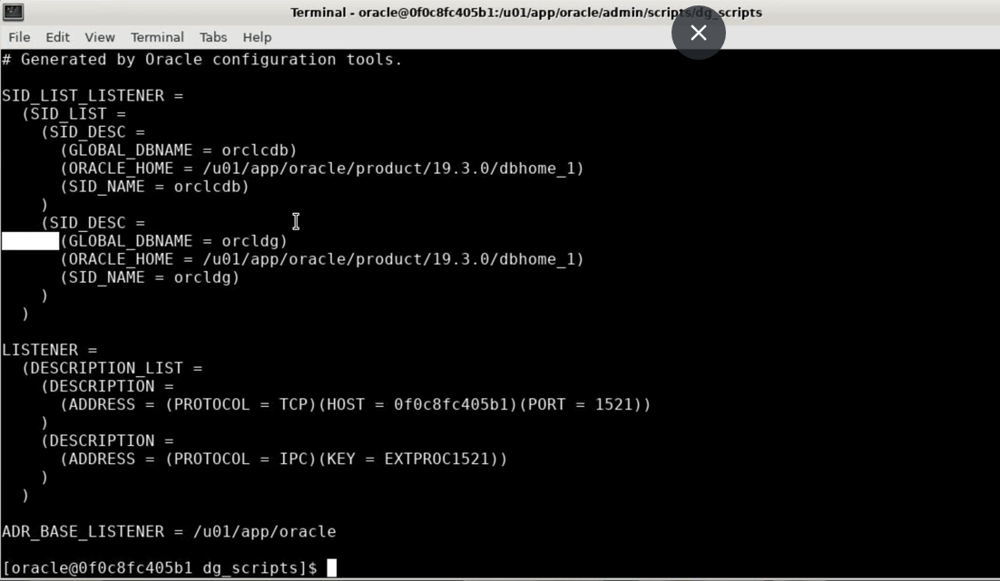

So now let's go ahead and start the replication.

So first of I come over here in this particular environment,


Check your destination or auxiliary database is actually up and running.

`ps -ef | grep smon`


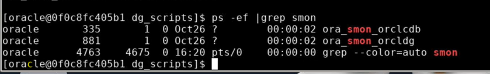

So we're gonna go ahead and shut that down. If it is up and running, let's go ahead and check.
 

So let's go ahead `echo $ORACLE_SID`,


Confim It's pointing it in the DG environment.


Let's go ahead and do a shutdown immediate.

```
sqlplus / as sysdba

shutdown immediate;
```

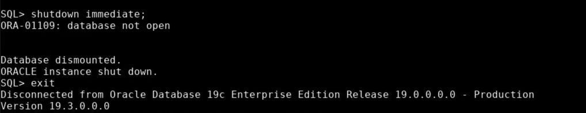


So now I do a SQL Plus as assists DBA, we have to start at the destination in a no mount phase. So we do a startup, nomount.


```
sqlplus / as sysdba

startup nomount;

exit
```


So that instance starts.


Now we're gonna connect to RMan and stay in dg_scripts directory.


```
pwd

more create_standby.sql
```


Let's do a more on create standby. So, that's connecting to the source:

`rman target sys/fenago@orclcdb auxiliary sys/fenago@orcldg`

So now we are connected to the target database, which is the source, the auxiliary database,
which is the destination. Now if it says ORCLCDB not mounted, that's right because remember the database 
names have to be the same.


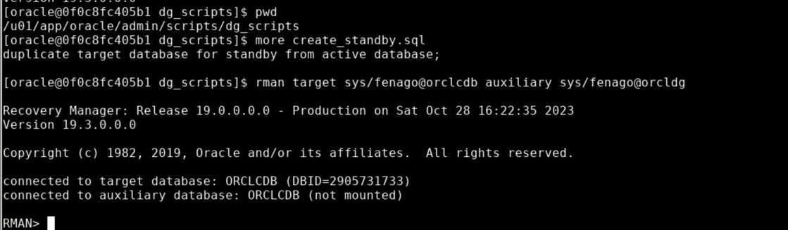


So then to duplicate database, run the following command:

`duplicate target database for standby from active_database;`


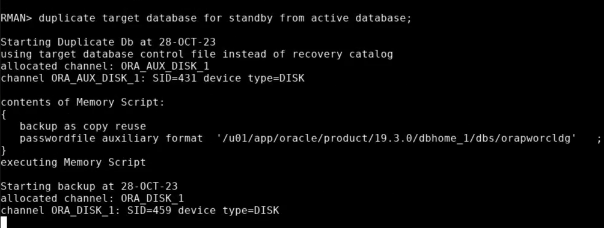


And this will create our data guard environment. So, this will do a complete and total clone from the primary to the secondary. 

When this is up and running, we'll have replication going and I will show you how to do, I will show you how to confirm that here in just a second. This may take a minute or two to complete. So let's just give it some time.
Looks like this is restoring everything just fine.


So it's there. So now let's `echo $ORACLE_SID`.


So the data guard environment, let's take a look at some of the scripts that we have here.


```
sqlplus / as sysdba
```


if we go ahead and we get the script called mr. The MR script identifies as manager recovery up and running.

`get mr`

It doesn't look like it is running.


Oh well first of all, let's do this. Let's do an enable dg.

`@enable_dg`


We can take a look at that script. So, so to enable data guard, it's altered database recovery, alter database recovery managed standby by database, try to run this again.


`get mr`

Now, this is telling us that managed recovery is running.


Let's open up another terminal session over here and use `orclcdb` as the primary.


```
echo $ORACLE_SID

cd $ORACLE_BASE/admin/scripts/dg_scripts

sqlplus / as sysdba
```

Let's get the script called gap status:

`get gap_status`

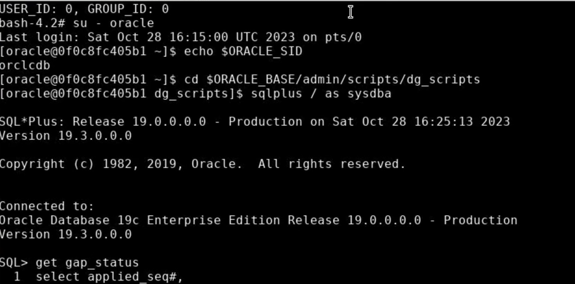

Sometimes you might see this `resolvable gap`. So switchlog file, I'll do this a couple times.

`alter system switch logfile;`

Now, rerun this script called gap_status.

`@gap_status`


So, there's gap. So let's go ahead and run another script out here, which is called Log Ship.

`@log_ship`

So let's take a look at the script called Log Ship. that means it's looking as log ship is not enabled.
So let's get this script called Enable Log Ship.

`@enable_log_ship`

We're gonna enable it.
So let's go ahead and look at Log ship.

`@log_ship`

Now let's go ahead and take a look at the gap status and we can see no gap.

`@gap_status`


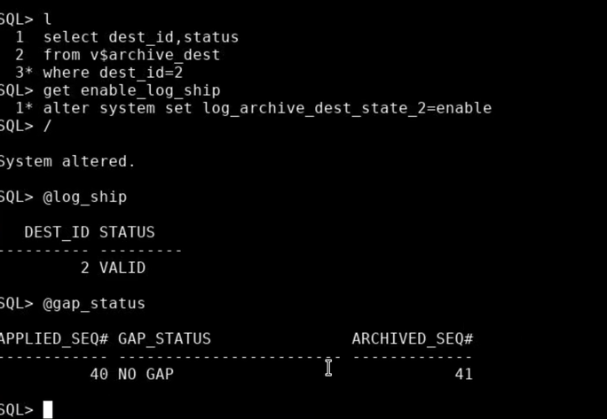

So what we can see is that now you're looking for this, what's been applied,

what's been shipped, and it makes sure that that status is no gap.

Let's run `alter system switch logfile;`, we're gonna do this a couple times and what we're gonna see is that these numbers should change or increment. You see right here, this number here, that's log sequence that's waiting for is 41. 

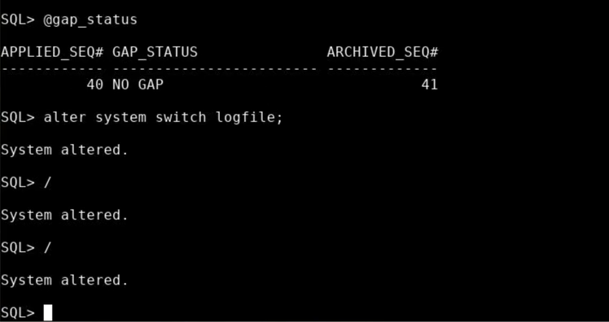

Let's run command in terminal 1 and confirm it's been increasing, it's 47, so that's good.

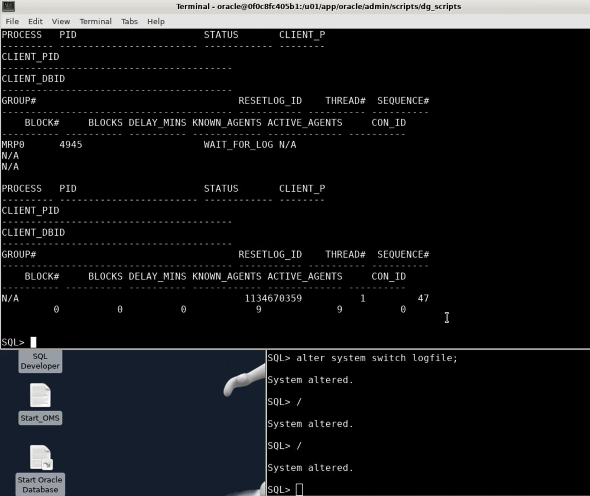

Let's go ahead and get this script called Gap status and we can see that these two numbers are similar and there's no gap. 

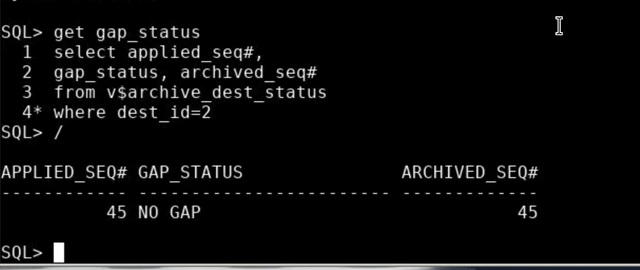


You have successfully, created your very first standby database. 
